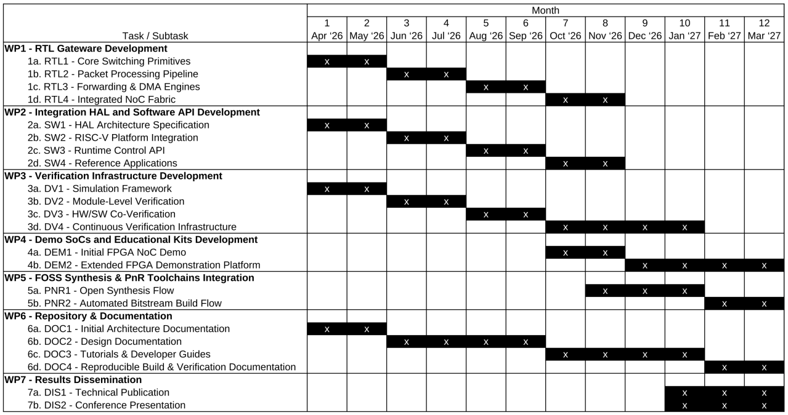

<!--
SPDX-FileCopyrightText: 2026 Enio Kaljic
SPDX-License-Identifier: CERN-OHL-S-2.0 AND AGPL-3.0-or-later AND CC-BY-SA-4.0
-->

# Scalable Ethernet-based Network-on-Chip

**openENOC** is an open-source hardware and software initiative that develops a modular and scalable Ethernet-based Network-on-Chip (NoC) architecture for FPGA SoCs and advanced MPSoC designs. By adopting standard Ethernet Layer 2 as the native on-chip transport protocol, rather than relying on traditional mesh or proprietary interconnects, openENOC enables seamless integration with existing Ethernet infrastructure and establishes a unified communication and programming model across both on-chip and off-chip systems.

   

This approach allows processors, accelerators, and peripherals to be connected through a flexible, packet-switched network based on L2 switching, effectively bridging the gap between on-chip and off-chip networking while lowering the complexity of building large-scale systems.

The concept originated from practical challenges encountered during the development of the NLnet-funded [WireGuard FPGA project](https://nlnet.nl/project/KlusterLab-Wireguard/), where scaling cryptographic workloads such as Curve25519 and ChaCha20-Poly1305 exposed limitations of conventional interconnect architectures. In response, openENOC introduces an Ethernet-based interconnect designed to support efficient, network-oriented scaling of cryptographic processing, edge computing, and AI acceleration workloads.

openENOC aims to deliver a complete, freely licensed full-stack solution combining reusable hardware and software gateware developed in SystemVerilog and C/C++. Built in alignment with open hardware and open source software principles, the project will provide RTL components, integration APIs, verification infrastructure, and reference designs, forming a cohesive and production ready foundation.

Its primary goal is to unlock the potential of networked reconfigurable computing by making it accessible, portable, and adaptable across a wide range of use cases. The architecture is designed with modularity at its core, enabling gradual adoption, straightforward customization, and seamless extension. This makes it suitable not only for demanding workloads such as cryptography and edge computing, where traditional interconnects struggle to scale, but also for a broad audience including academia, industry, hobbyists, and the maker community.

All results will be released openly to encourage reuse, strengthen the open hardware ecosystem, and empower developers and organizations to build interoperable, future proof, and community driven MPSoC solutions.

## Repository Structure

The openENOC repository is organized into a set of clearly separated functional areas covering hardware design, external libraries, software development, hardware abstraction, verification, documentation, platform integration, and project automation. The following table provides a high-level overview of the repository structure and the purpose of each top-level directory.

| Directory | Description |
|-----------|-------------|
| `docs/` | Project documentation sources and assets. |
| `hal/` | Hardware Abstraction Layer sources, register definitions, code generators, and related tooling. |
| `hw/` | Hardware sources: reusable RTL under `hw/rtl/`, reference designs under `hw/examples/`, and platform demonstrations under `hw/demos/`. |
| `sw/` | Software libraries, drivers, utilities, and application support code. |
| `dv/` | Design verification environment, including shared verification infrastructure, component-level verification, example verification, and hardware demos verification. |
| `libs/` | External hardware and software libraries tracked as Git submodules. |
| `build/` | Generated build artifacts, simulation outputs, generated code, and intermediate files. |
| `ci/` | Continuous integration scripts and automation utilities used by development and release workflows. |
| `.github/workflows/` | GitHub Actions workflow definitions for documentation generation, automated testing, and release processes. |
| `LICENSES/` | License texts and third-party licensing information. |

## Project Plan

The project is organized around [four global milestones (M1-M4)](https://github.com/eniokaljic/openENOC/milestones) representing successive development phases of the openENOC platform: architecture definition, functional prototyping, system integration, and final platform release. Each work package contributes to these milestones through a set of incremental subtasks that implement, validate and demonstrate different aspects of the system.

   

This structure ensures that hardware development, software integration, verification, tooling and documentation progress in parallel throughout the project. Early milestones focus on establishing the architecture and initial prototypes, while later milestones concentrate on system integration, validation and public release of a complete open platform. Each subtask (e.g. RTL1, SW1, DV1, etc.) contributes to one or more milestones and produces tangible intermediate results that collectively lead to the final openENOC platform.

Task status is indicated using the following icons: &#x2b1c; To Do, &#x1F7E9; In Progress, and &#x2705; Done.

### WP1 - RTL Gateware Development

This work package delivers the complete openENOC RTL implementation forming the hardware datapath of the Ethernet-based Network-on-Chip. The development progresses from basic switching primitives and datapath elements (RTL1), through packet processing pipeline components (RTL2), to forwarding engines and DMA-capable endpoint connectivity (RTL3). The final stage integrates all components into a configurable Ethernet Layer-2 switching fabric suitable for MPSoC integration (RTL4).

- &#x2705; [RTL1 - Core Switching Primitives](https://github.com/eniokaljic/openENOC/issues/1)
- &#x2705; [RTL2 - Packet Processing Pipeline](https://github.com/eniokaljic/openENOC/issues/2)
- &#x1F7E9; [RTL3 - Forwarding & DMA Engines](https://github.com/eniokaljic/openENOC/issues/3)
- &#x2b1c; [RTL4 - Integrated NoC Fabric](https://github.com/eniokaljic/openENOC/issues/4)

### WP2 - Integration HAL and Software API Development

This work package provides the software interface layer required to configure and control the NoC. It begins with the definition of the hardware abstraction layer and register-level interface (SW1), followed by integration with representative RISC-V platforms (SW2). Runtime configuration capabilities are then implemented through a compact baremetal C/C++ API (SW3), while the final stage delivers reference applications demonstrating practical NoC usage scenarios (SW4).

- &#x2705; [SW1 - HAL Architecture Specification](https://github.com/eniokaljic/openENOC/issues/5)
- &#x2705; [SW2 - RISC-V Platform Integration](https://github.com/eniokaljic/openENOC/issues/6)
- &#x1F7E9; [SW3 - Runtime Control API](https://github.com/eniokaljic/openENOC/issues/7)
- &#x2b1c; [SW4 - Reference Applications](https://github.com/eniokaljic/openENOC/issues/8)

### WP3 - Verification Infrastructure Development

This work package establishes the verification infrastructure required to validate both the hardware and software components of the platform. It begins with the creation of a simulation environment using Verilator, cocotb and related tools (DV1). Layered testbenches are then developed to verify core datapath modules and packet processing logic (DV2). Hardware/software interaction is validated through co-simulation with instruction set simulation (DV3), and finally continuous regression testing is deployed through automated CI pipelines (DV4).

- &#x2705; [DV1 - Simulation Framework](https://github.com/eniokaljic/openENOC/issues/9)
- &#x2705; [DV2 - Module-Level Verification](https://github.com/eniokaljic/openENOC/issues/10)
- &#x1F7E9; [DV3 - HW/SW Co-Verification](https://github.com/eniokaljic/openENOC/issues/11)
- &#x2b1c; [DV4 - Continuous Verification Infrastructure](https://github.com/eniokaljic/openENOC/issues/12)

### WP4 - Demo SoCs and Educational Kits Development

This work package demonstrates the practical applicability of openENOC through deployable FPGA-based systems. The first stage delivers a minimal reference SoC integrating a RISC-V core and openENOC on a low-cost FPGA board (DEM1). The second stage expands the platform with additional endpoints and external Ethernet connectivity, enabling full system demonstrations that bridge on-chip and off-chip networking (DEM2).

- &#x2b1c; [DEM1 - Initial FPGA NoC Demo](https://github.com/eniokaljic/openENOC/issues/13)
- &#x2b1c; [DEM2 - Extended FPGA Demonstration Platform](https://github.com/eniokaljic/openENOC/issues/14)

### WP5 - FOSS Synthesis & PnR Toolchains Integration

This work package ensures that openENOC can be built using a fully open-source FPGA toolchain. Initial work integrates the RTL design with synthesis tools such as Yosys and openXC7 (PNR1). The final stage establishes automated place-and-route flows and CI-driven bitstream generation using openXC7/nextpnr, enabling reproducible builds and continuous integration (PNR2).

- &#x2b1c; [PNR1 - Open Synthesis Flow](https://github.com/eniokaljic/openENOC/issues/19)
- &#x2b1c; [PNR2 - Automated Bitstream Build Flow](https://github.com/eniokaljic/openENOC/issues/20)

### WP6 - Repository & Documentation

This work package produces the technical documentation and developer resources necessary to make the project accessible and reusable by the wider open hardware community. Initial architecture documentation describing the design concepts and packet model is produced first (DOC1). Detailed design documentation of RTL modules and interfaces follows (DOC2). Tutorials and developer guides are then prepared to demonstrate simulation and FPGA deployment workflows (DOC3), and the final stage documents reproducible build and verification processes (DOC4).

- &#x2705; [DOC1 - Initial Architecture Documentation](https://github.com/eniokaljic/openENOC/issues/15)
- &#x1F7E9; [DOC2 - Design Documentation](https://github.com/eniokaljic/openENOC/issues/16)
- &#x2b1c; [DOC3 - Tutorials & Developer Guides](https://github.com/eniokaljic/openENOC/issues/17)
- &#x2b1c; [DOC4 - Reproducible Build & Verification Documentation](https://github.com/eniokaljic/openENOC/issues/18)

### WP7 - Results Dissemination

This work package focuses on communicating the results of the project to the broader open hardware and research communities. The work includes preparation of a technical publication describing the architecture and implementation of openENOC (DIS1) as well as presentation of the project results at relevant open hardware or FPGA-related events (DIS2).

- &#x2b1c; [DIS1 - Technical Publication](https://github.com/eniokaljic/openENOC/issues/21)
- &#x2b1c; [DIS2 - Conference Presentation](https://github.com/eniokaljic/openENOC/issues/22)

## License
This project uses open copyleft licenses to ensure compatibility with existing open hardware and open-source software ecosystems while preserving transparency, reproducibility, and long-term community collaboration.

See [`LICENSE.md`](LICENSE.md) for detailed licensing information.

## Acknowledgements
We are grateful to **NLnet Foundation** for their sponsorship of this development activity.

   &nbsp;&nbsp;&nbsp;&nbsp;&nbsp;&nbsp;
   

This project was funded through the [NGI0 Commons Fund](https://nlnet.nl/commonsfund), a fund established by [NLnet](https://nlnet.nl/) with financial support from the European Commission's [Next Generation Internet](https://ngi.eu/) programme, under the aegis of [DG Communications Networks, Content and Technology](https://commission.europa.eu/about-european-commission/departments-and-executive-agencies/communications-networks-content-and-technology_en) under grant agreement No [101135429](https://cordis.europa.eu/project/id/101135429). Additional funding is made available by the [Swiss State Secretariat for Education, Research and Innovation](https://www.sbfi.admin.ch/sbfi/en/home.html) (SERI).

### End of Document
