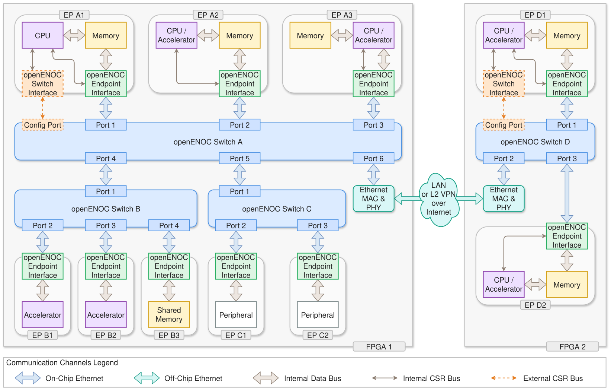
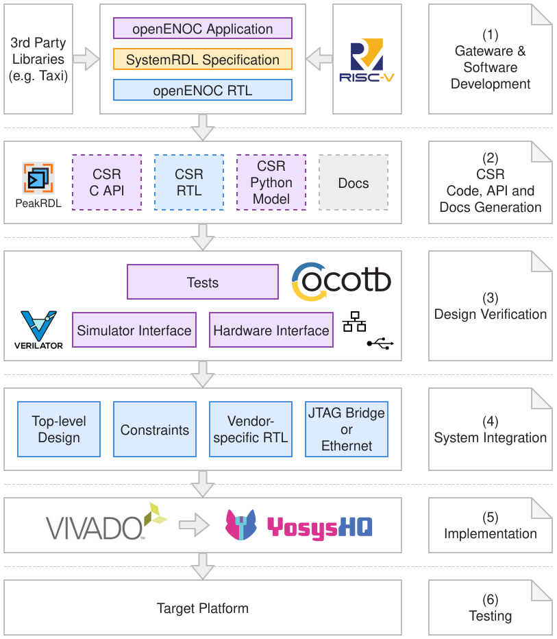

.. SPDX-FileCopyrightText: 2026 Enio Kaljic
.. SPDX-License-Identifier: CC-BY-SA-4.0

openENOC System Architecture
============================

Introduction
------------

The proposed openENOC system architecture is motivated by the need for a scalable and modular communication substrate for modern MPSoC platforms. As the number of integrated processing elements, accelerators, memories, and peripherals continues to grow, traditional shared buses and point-to-point interconnects become increasingly difficult to scale in terms of bandwidth, latency, and design complexity. For this reason, the Network-on-Chip (NoC) paradigm has become a widely adopted architectural direction for complex SoCs, replacing ad hoc global wiring with structured packet-based communication and better supporting system expansion and integration [1]_.

The openENOC architecture is based on an Ethernet-inspired Network-on-Chip (NoC) that uses Layer-2 packet switching to interconnect CPUs, accelerators, peripherals, and memories within scalable MPSoC systems through a uniform communication model. This approach allows both on-chip and off-chip communication to be handled in a consistent way, making the architecture modular, extensible, and well suited for heterogeneous computing platforms targeting cryptography, AI, and edge workloads.

This architectural choice is further supported by the increasing heterogeneity of contemporary computing systems. Modern workloads combine general-purpose processors with specialized accelerators, producing communication patterns that are more diverse and demanding than those in conventional multicore designs. Recent research shows that NoC architectures for heterogeneous systems must provide flexible and scalable transport mechanisms capable of efficiently supporting different traffic types and bandwidth requirements [2]_. Designing openENOC as a packet-switched communication backbone directly addresses these needs.

The decision to adopt Ethernet-inspired Layer-2 packet switching is also practical from both implementation and system-design perspectives. Packet-based communication improves modularity and composability because system components interact through standardized frames rather than tightly coupled dedicated links. Prior work on scalable interconnection architectures has shown the value of using common packet-based communication mechanisms across both on-chip and off-chip domains, improving system integration and extensibility in complex MPSoC platforms [3]_. This makes Layer-2 switching a suitable foundation for an open and extensible hardware communication fabric.

Recent open-source NoC research also highlights the importance of scalable transport, support for parallel data streams, and efficient handling of both high-throughput and latency-sensitive traffic in accelerator-rich systems [4]_. These observations are aligned with the goals of openENOC, which seeks to provide a unified interconnect for CPUs, accelerators, peripherals, and memories across a broad range of application domains.

Finally, the proposed architecture is consistent with broader trends in open heterogeneous SoC design, where modular integration, standardized interfaces, and FPGA prototyping are key enablers for experimentation and deployment [5]_. In this context, an Ethernet-based NoC provides a forward-looking balance between scalability, implementation simplicity, and system interoperability.

.. raw:: html

    

The architecture illustrated above is built around four main building blocks: the **openENOC Switch**, the **openENOC Control Interface**, the **openENOC Endpoint Interface**, and the **openENOC Transport Protocol (oETP)**. Together, these building blocks separate forwarding, management, endpoint adaptation, and transport semantics into independent architectural layers.

This chapter presents a system-level architectural overview of openENOC and introduces the major architectural components and their relationships. Detailed implementation and protocol specifications are provided in subsequent chapters.

.. index:: Switch

openENOC Switch
---------------

The openENOC Switch is the central packet-forwarding element of the openENOC architecture that connects processors, accelerators, peripherals, and memories through the openENOC Endpoint Interface. It supports an arbitrary number of ports and provides Layer-2 forwarding between attached components using Ethernet frame semantics. In this role, the switch forms the communication backbone of the openENOC architecture and establishes the substrate over which higher-level communication behavior can be built.

The switch can operate in two modes:

* **Unmanaged mode**: the switch operates autonomously and passively learns MAC address-to-port relationships from the traffic passing through it. This functionality is implemented by an integrated RTL controller that updates the forwarding state dynamically based on observed frames.
* **Managed mode**: the switch is configured by an external processor connected through the openENOC Control Interface. In this mode, MAC learning and forwarding behavior can be controlled using software-visible configuration mechanisms.

In addition to on-chip connectivity, switch ports may also be connected to Ethernet MAC & PHY controllers to extend communication beyond the chip boundary. This allows openENOC-based systems to scale from purely on-chip communication fabrics toward distributed multi-FPGA systems while preserving the same Ethernet-based forwarding model. As a result, the switch is not only the core of local communication, but also the bridge toward larger multi-device deployments.

.. index:: Control Interface

openENOC Control Interface
--------------------------

The openENOC Control Interface is a memory-mapped interface used to configure and monitor the openENOC Switch. It exposes configuration and status registers (CSRs), the memory model of the MAC forwarding table, and related control structures required for managed operation. Through this interface, software can observe and influence the behavior of the switching fabric without changing the data-plane abstraction presented to the rest of the system.

When the switch operates in managed mode, a processor accesses this interface to define forwarding behavior, populate or update MAC address mappings, inspect switch state, and react to network events or topology-specific requirements. This enables software-defined traffic management while keeping the forwarding substrate modular and reusable.

In architectural terms, the control interface complements the switch by separating control-plane responsibilities from packet forwarding. This distinction becomes especially important in systems where only selected endpoints require authority over the communication domain, while the remaining components interact with the network strictly through data exchange.

Systems that rely exclusively on autonomous switching behavior may omit the control interface entirely and operate the switch in unmanaged mode.

.. index:: Endpoint Interface

openENOC Endpoint Interface
---------------------------

The openENOC Endpoint Interface is the termination point for Ethernet communication arriving from the openENOC Switch. Every resource attached to the openENOC fabric, including processors, accelerators, memories, and peripherals, is represented on the network through an openENOC Endpoint Interface. It provides both *memory-mapped* and *streaming* integration models, allowing different classes of compute and memory resources to connect to the common network in a manner appropriate to their communication style.

Depending on the attached resource, an endpoint may incorporate DMA functionality, local buffering, protocol adaptation, address translation, or application-specific processing logic. The endpoint abstraction therefore represents a generic attachment mechanism rather than a specific communication engine.

For memory-oriented deployments, endpoint implementations may operate in two common modes:

* **Standalone mode**: the integrated controller autonomously handles DMA transfer coordination, memory range mapping, and data replication and synchronization.
* **Non-standalone mode**: the endpoint is connected to a processor through its own CSR interface. In this case, the processor controls DMA-related functions such as interrupts, descriptors, and transfer management.

This makes the endpoint suitable both for memory-centric communication and for low-latency dataflow-oriented processing. More broadly, the endpoint interface serves as the adaptation layer between Ethernet-based packet transport and the local semantics of the attached block, whether that block is a CPU subsystem, an accelerator, a memory region, or a peripheral. When transport-level communication is required, endpoints may additionally implement oETP functionality to support remote memory operations and other higher-level communication services.

openENOC Transport Protocol
---------------------------

The openENOC Transport Protocol (oETP) defines the transport-layer semantics of the architecture. It supports communication patterns such as remote memory access, processor-to-processor communication, accelerator integration, and transparent interconnection across multi-FPGA systems. While the openENOC Switch, openENOC Control Interface, and openENOC Endpoint Interface define how components are connected and managed, oETP defines how memory-oriented transactions and related transport semantics are expressed over that Ethernet-based communication substrate.

Existing RDMA-over-Ethernet technologies, most notably RoCEv1, provide a natural starting point for Ethernet-based memory-centric communication. However, these protocols were originally designed for datacenter environments and inherit a significant portion of the InfiniBand transport model, including Queue Pair (QP) abstractions, work request management, connection state tracking, completion queues, and memory registration mechanisms [6]_. Furthermore, RoCEv1 assumes a lossless Ethernet fabric and relies on Priority Flow Control (PFC) to prevent packet loss [7]_. Multiple studies have shown that PFC can introduce head-of-line blocking, congestion propagation, and deadlock scenarios, increasing the complexity of both network infrastructure and endpoint implementations [8]_. Such mechanisms are difficult to justify in Network-on-Chip environments, where buffering resources are limited and implementation simplicity is a primary design objective.

To address these limitations, the openENOC project introduces oETP, a lightweight transport protocol specifically designed for Ethernet-based NoC systems. Rather than adopting the complete RDMA transport stack, oETP focuses on a minimal set of communication primitives required in hardware-centric MPSoC environments. The protocol employs compact packet headers optimized for the small transactions typical of NoC workloads, reducing communication overhead and hardware resource consumption. The exact addressing model, transaction encoding, and packet format are defined by the oETP specification and are outside the scope of this architectural overview.

oETP retains the most valuable aspect of the RDMA programming model by supporting one-sided memory operations, including remote read and remote write transactions, while eliminating Queue Pair infrastructure and other InfiniBand-specific transport semantics. Instead of relying on PFC, the protocol employs credit-based flow control, a widely used NoC technique that provides predictable behavior, efficient buffer utilization, and straightforward hardware implementation [9]_ [10]_.

By combining Ethernet framing, credit-based flow control, and RDMA-style one-sided memory operations, oETP targets tightly coupled hardware systems rather than distributed datacenter infrastructure. Within openENOC, the protocol is intended to operate over both on-chip Ethernet links inside a single MPSoC or FPGA system and off-chip Ethernet links connecting multiple FPGA-based domains through external MAC & PHY components. This allows the same transport model to span both local and multi-FPGA deployments while preserving a consistent programming and communication model across the entire Ethernet-based architecture.

Architectural Relationships
---------------------------

At the system level, the openENOC Switch forms the communication backbone, while each functional block is attached through an openENOC Endpoint Interface. The openENOC Control Interface is used where software-visible management of the switch is required, and the openENOC Transport Protocol (oETP) provides transport-level semantics for memory-oriented communication between endpoints across the same Ethernet-based fabric.

* the **switch** forwards Ethernet frames between ports,
* the **endpoint** adapts Ethernet communication to local computation, memory, or peripheral logic,
* the **control interface** provides optional software control over switch behavior,
* the **oETP** defines lightweight transport semantics for higher-level communication patterns such as remote reads and writes.

This separation enables the architecture to scale in several directions: multiple endpoints can share a common switch, specialized switches can be introduced for subsystems with different bandwidth or latency requirements, software control can be centralized where necessary, and transport-level behavior can remain consistent across both local and distributed Ethernet-connected domains.

Example Configurations
----------------------

The following examples refer to the architectural diagram shown earlier and illustrate representative ways in which openENOC components can be combined to address different communication and integration requirements.

EP A1: Managed switch operation with processor-coordinated DMA
~~~~~~~~~~~~~~~~~~~~~~~~~~~~~~~~~~~~~~~~~~~~~~~~~~~~~~~~~~~~~~

**EP A1** illustrates a configuration in which **openENOC Switch A** operates in managed mode. A processor is connected to the switch configuration port through the openENOC Control Interface, and the corresponding endpoint uses DMA-capable communication through the openENOC Endpoint Interface.

This use case is suitable for systems that require explicit software control over network behavior, for example when traffic policies must be tuned at runtime or when integration with higher-level resource management software is required.

Because the switch provides only a single configuration port, this managed setup typically applies to one controlling endpoint in that switch domain. Other endpoints connected to the same switch, such as accelerators or memories, may still exchange traffic through the same fabric without direct access to switch management. In such a setup, oETP can provide a common transport abstraction for memory-oriented transactions while the processor retains control over switching policy.

EP A2: Data endpoint without switch control access
~~~~~~~~~~~~~~~~~~~~~~~~~~~~~~~~~~~~~~~~~~~~~~~~~~

**EP A2** shows a standard endpoint connected to **openENOC Switch A** without direct access to the switch control interface. It still uses the openENOC Endpoint Interface for communication with integrated memory, processing, or peripheral logic, but relies on the switch behavior established elsewhere in the system.

This arrangement is useful when one software-visible control point manages a larger communication domain, while other endpoints remain focused on data exchange only. From the perspective of higher-level communication, such endpoints may still participate in oETP-based transactions even though they do not manage the switch directly.

EP A3: Direct processor/accelerator connection for streaming applications
~~~~~~~~~~~~~~~~~~~~~~~~~~~~~~~~~~~~~~~~~~~~~~~~~~~~~~~~~~~~~~~~~~~~~~~~~

**EP A3** illustrates direct attachment of the openENOC Endpoint Interface to a processor or accelerator without using DMA. In this setup, incoming data is consumed directly by the computational logic, enabling a streamlined path between the network fabric and a latency-sensitive processing element.

This model is particularly suitable for streaming-oriented applications, where low-latency processing is more important than bulk memory transfers. Typical examples include packet inspection, signal processing, and accelerator pipelines operating on continuous data streams, and other workloads where data should be processed as it arrives rather than first copied into memory.

Switch B: Dedicated high-bandwidth subnet for accelerators and shared memory
~~~~~~~~~~~~~~~~~~~~~~~~~~~~~~~~~~~~~~~~~~~~~~~~~~~~~~~~~~~~~~~~~~~~~~~~~~~~~

When multiple accelerators share a common memory and communicate intensively with it, connecting all traffic through a single general-purpose switch may become a scalability bottleneck. The architecture therefore allows additional switches to be introduced as specialized communication domains optimized for particular traffic profiles.

In the diagram, **EP B1** and **EP B2** represent accelerators, while **EP B3** represents shared memory. By isolating this traffic on a dedicated switch operating at speeds tuned to the acceleration subsystem, the design can improve throughput and reduce interference with the rest of the MPSoC interconnect. Such a subnet is also a natural environment for lightweight transport semantics such as those provided by oETP, especially when the dominant communication pattern is remote memory access between tightly coupled hardware blocks.

This pattern is especially useful for accelerator clusters with heavy memory traffic, where communication characteristics differ significantly from those of the rest of the SoC.

Switch C: Dedicated low-speed or hierarchical peripheral subnet
~~~~~~~~~~~~~~~~~~~~~~~~~~~~~~~~~~~~~~~~~~~~~~~~~~~~~~~~~~~~~~~

Some peripherals operate at substantially lower speeds than CPUs, accelerators, or memory subsystems. In such cases, attaching them directly to a high-performance switch may be inefficient. The architecture therefore supports dedicated lower-speed or hierarchical subnetworks that better match the requirements of peripheral communication.

In the diagram, **EP C1** and **EP C2** are peripheral endpoints connected to this lower-speed subsystem. This organization is also useful in hierarchical communication topologies, where different parts of the system are grouped according to bandwidth, latency, or functional role. In that sense, the arrangement is analogous to a *northbridge/southbridge* style decomposition in traditional computer architectures. Within such a hierarchy, the same endpoint abstraction is preserved even when the communication characteristics of the subnet differ from those of the primary switch domain.

Using dedicated peripheral switches improves modularity and allows each subsystem to operate at a communication rate appropriate to its role.

Off-chip scaling across multi-FPGA systems
~~~~~~~~~~~~~~~~~~~~~~~~~~~~~~~~~~~~~~~~~~

The architecture also supports scaling beyond a single FPGA-based MPSoC. By connecting Ethernet MAC & PHY controllers to switch ports, communication can be extended from on-chip to off-chip domains while preserving the same Ethernet-based framing and switching model.

This enables multiple openENOC domains to be combined into a larger communication fabric while preserving the same endpoint abstraction. From the perspective of the endpoints, the communication model remains consistent, which simplifies the extension of software and hardware components from a local MPSoC setting to a distributed deployment. In this broader setting, oETP provides an especially important role by allowing the same lightweight transport semantics to span both on-chip and off-chip Ethernet links.

When FPGA systems are geographically distributed or connected through the Internet, the external network must provide Ethernet connectivity at Layer 2, which may require appropriate L2 VPN infrastructure depending on the deployment environment. Communication security in such deployments is outside the scope of openENOC itself and must be provided by the external network environment.

On **FPGA 2**, **openENOC Switch D** mirrors the same architectural principles used on **FPGA 1**. **EP D1** shows a processor/accelerator plus memory subsystem with managed-switch capability through the control interface, while **EP D2** and **EP D3** illustrate additional connected resources within the remote communication domain.

In other words, openENOC is not limited to a single-chip NoC; it can be extended into distributed Ethernet-connected multi-FPGA deployments. Because the same switch, endpoint, control, and transport concepts are preserved, the architecture remains conceptually uniform even as it scales from local integration to geographically distributed systems.

Development and Integration Flow
--------------------------------

The openENOC project is designed around a model-driven development workflow that enables a consistent transition from hardware and software design to verification, system integration, and deployment. The development and integration flow shown below illustrates how the various project artefacts are generated and used throughout the design lifecycle.

.. raw:: html

    

The process begins with the development of openENOC hardware and software components together with a SystemRDL specification describing the Control and Status Register (CSR) interface. The SystemRDL description serves as a single source of truth for the register map and enables automatic generation of implementation and verification artefacts using PeakRDL.

From the SystemRDL specification, the build system generates synthesizable CSR RTL, software-accessible CSR APIs, a Python register model, and associated documentation. This approach ensures consistency between hardware, software, and verification environments while significantly reducing manual maintenance effort.

The generated Python register model is integrated into the verification framework, which is based on cocotb and Verilator. Together with simulator interfaces, hardware interfaces, and automated test suites, this environment enables functional verification of individual openENOC components as well as complete subsystem configurations. By deriving verification artefacts from the same register specification used by hardware and software, the risk of inconsistencies between implementation and test environments is minimized.

To support continuous validation of the design, the verification infrastructure is intended to be integrated into a Continuous Integration (CI) workflow. Automated execution of simulation, verification, and build tasks enables functional regressions to be detected early and ensures that modifications to RTL, software components, register definitions, or verification infrastructure do not introduce unintended behavior. While GitHub Actions currently serves as the primary CI platform, the underlying procedures are designed to remain platform-independent. Verification and build workflows are implemented using portable scripts and standardized tooling interfaces, allowing them to be executed in alternative CI environments such as GitLab CI, Jenkins, Buildbot, or self-hosted automation systems without modification to the overall methodology.

Following successful verification, the generated RTL and openENOC components are integrated into a target platform design. This stage includes the creation of top-level designs, implementation constraints, vendor-specific integration logic, and external access mechanisms such as JTAG or Ethernet-based control interfaces.

The resulting design can then be processed using either vendor toolchains or open-source FPGA implementation flows to generate a deployable hardware image. Once programmed onto the target platform, the complete system can be validated using software-driven functional tests and application-level workloads.

This workflow establishes a unified development methodology in which hardware design, software development, verification, continuous integration, and deployment are derived from a common set of specifications. The approach improves maintainability, reproducibility, and scalability while facilitating collaboration across different hardware platforms, toolchains, and deployment environments.

Summary
-------

Overall, the openENOC system architecture combines Ethernet-style packet switching with configurable endpoint integration and a lightweight transport model to provide a scalable communication substrate for heterogeneous MPSoC systems. The resulting design separates switching, control, endpoint adaptation, and transport semantics into distinct but cooperating architectural components.

The architecture supports several important deployment patterns, including software-managed switching, DMA-based memory transfers, direct streaming data paths, dedicated subnetworks for specialized traffic classes, and off-chip scaling across multi-FPGA systems. By introducing oETP alongside the existing switch and interface abstractions, openENOC establishes a transport layer suitable for efficient memory-centric communication across both on-chip and off-chip Ethernet domains.

A defining characteristic of openENOC is the use of a common Ethernet-based communication model across both on-chip and off-chip domains, enabling the same architectural concepts to scale from individual FPGA devices to distributed multi-FPGA systems. This approach promotes architectural consistency while simplifying integration with existing Ethernet-oriented hardware and software ecosystems.

Beyond the communication architecture itself, openENOC adopts a model-driven development methodology in which hardware, software, verification, and documentation artefacts are derived from a common set of specifications. Automated artefact generation, reusable verification infrastructure, and platform-independent Continuous Integration workflows help ensure consistency across the development lifecycle while improving maintainability, reproducibility, and portability. Together, these architectural and development principles provide a foundation for building scalable, verifiable, and extensible Ethernet-based interconnect systems.

References
----------

.. [1] T. Bjerregaard and S. Mahadevan, "A survey of research and practices of network-on-chip," in *ACM Computing Surveys*, vol. 38, no. 1, pp. 1–51, 2006. 
   `(link) <https://dl.acm.org/doi/10.1145/1132952.1132953>`_

.. [2] S. Biglari, F. Hosseini, A. Upadhyay and H. Zhao, "Survey of Network-on-Chip (NoC) for Heterogeneous Multicore Systems," *2024 IEEE 17th International Symposium on Embedded Multicore/Many-core Systems-on-Chip (MCSoC)*, Kuala Lumpur, Malaysia, 2024, pp. 155-162, doi: 10.1109/MCSoC64144.2024.00036.
   `(link) <https://par.nsf.gov/servlets/purl/10552564>`_

.. [3] A. Biagioni, F. Lo Cicero, A. Lonardo, P. S. Paolucci, M. Perra, D. Rossetti, C. Sidore, F. Simula, L. Tosoratto and P. Vicini, "The Distributed Network Processor: a novel off-chip and on-chip interconnection network architecture," arXiv preprint arXiv:1203.1536, 2012.
   `(link) <https://arxiv.org/abs/1203.1536>`_

.. [4] T. Fischer, M. Rogenmoser, T. Benz, F. K. Gürkaynak and L. Benini, "FlooNoC: A 645-Gb/s/link 0.15-pJ/B/hop Open-Source NoC With Wide Physical Links and End-to-End AXI4 Parallel Multistream Support," in *IEEE Transactions on Very Large Scale Integration (VLSI) Systems*, vol. 33, no. 4, pp. 1094-1107, April 2025, doi: 10.1109/TVLSI.2025.3527225.
   `(link) <https://arxiv.org/abs/2409.17606>`_

.. [5] J. Zuckerman, P. Mantovani, D. Giri and L. P. Carloni, "Enabling Heterogeneous, Multicore SoC Research with RISC-V and ESP," arXiv preprint arXiv:2206.01901, 2022.
   `(link) <https://arxiv.org/abs/2206.01901>`_
   
.. [6] NVIDIA, *RDMA Aware Networks Programming User Manual*, NVIDIA Networking Documentation.
   `(link) <https://docs.nvidia.com/networking/display/rdmaawareprogrammingv17>`_

.. [7] NVIDIA, *RDMA over Converged Ethernet (RoCE)*, Cumulus Linux Documentation.
   `(link) <https://docs.nvidia.com/networking-ethernet-software/cumulus-linux/Layer-1-and-Switch-Ports/Quality-of-Service/RDMA-over-Converged-Ethernet-RoCE/>`_

.. [8] R. Mittal, A. Shpiner, A. Panda, E. Zahavi, A. Krishnamurthy, S. Ratnasamy and S. Shenker, "Revisiting Network Support for RDMA," in *Proceedings of the ACM SIGCOMM Conference*, 2018.
   `(link) <https://arxiv.org/abs/1806.08159>`_

.. [9] M. Coenen, S. Murali, A. Radulescu, K. Goossens and G. De Micheli, "A Buffer-Sizing Algorithm for Networks-on-Chip Using TDMA and Credit-Based End-to-End Flow Control," in *Proceedings of CODES+ISSS*, 2006.
   `(link) <https://www.cs.york.ac.uk/rts/docs/CODES-EMSOFT-CASES-2006/codes/p130.pdf>`_

.. [10] N. Concer, L. Bononi, M. Soulie, R. Locatelli and L. P. Carloni, "The Connection-Then-Credit Flow Control Protocol for Heterogeneous Multicore Systems-on-Chip," in *IEEE Transactions on Computer-Aided Design of Integrated Circuits and Systems*, vol. 29, no. 6, pp. 869-882, June 2010, doi: 10.1109/TCAD.2010.2048592.
   `(link) <https://ieeexplore.ieee.org/document/5467323>`_

