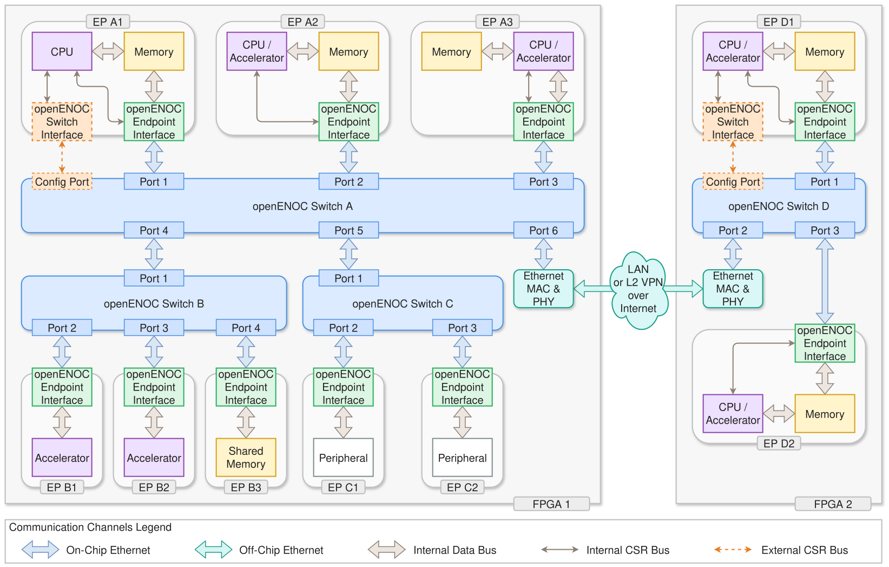
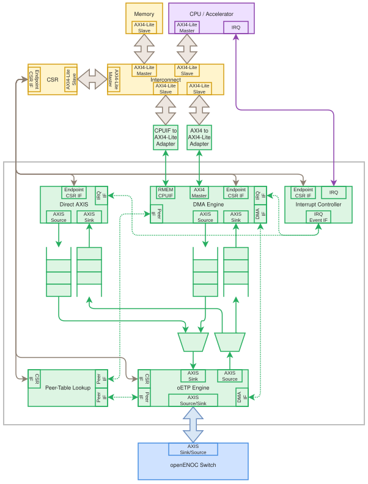
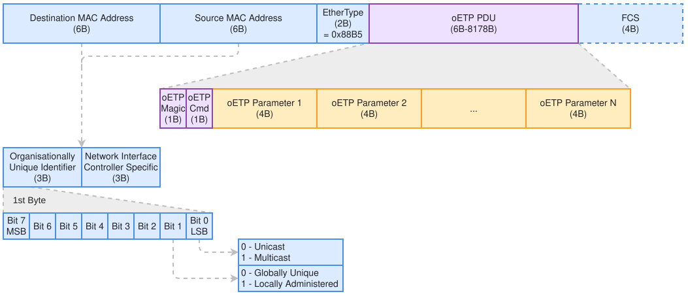
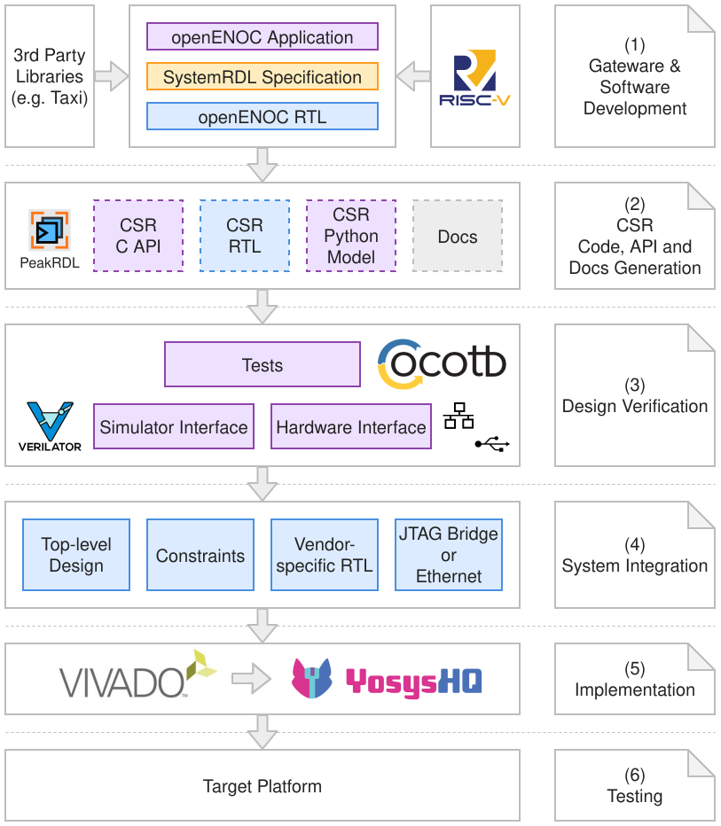

.. SPDX-FileCopyrightText: 2026 Enio Kaljic
.. SPDX-License-Identifier: CC-BY-SA-4.0

System Architecture
===================

Introduction
------------

The proposed openENOC system architecture is motivated by the need for a scalable and modular communication substrate for modern MPSoC platforms. As the number of integrated processing elements, accelerators, memories, and peripherals continues to grow, traditional shared buses and point-to-point interconnects become increasingly difficult to scale in terms of bandwidth, latency, and design complexity. For this reason, the Network-on-Chip (NoC) paradigm has become a widely adopted architectural direction for complex SoCs, replacing ad hoc global wiring with structured packet-switched communication and better supporting system expansion and integration [1]_.

The openENOC architecture is based on an Ethernet-inspired Network-on-Chip (NoC) that uses Layer-2 Ethernet frame switching to interconnect CPUs, accelerators, peripherals, and memories within scalable MPSoC systems through a uniform communication model. This approach allows both on-chip and off-chip communication to be handled in a consistent way, making the architecture modular, extensible, and well suited for heterogeneous computing platforms targeting cryptography, AI, and edge workloads.

This architectural choice is further supported by the increasing heterogeneity of contemporary computing systems. Modern workloads combine general-purpose processors with specialized accelerators, producing communication patterns that are more diverse and demanding than those in conventional multicore designs. Recent research shows that NoC architectures for heterogeneous systems must provide flexible and scalable transport mechanisms capable of efficiently supporting different traffic types and bandwidth requirements [2]_. Designing openENOC as an Ethernet-switched communication backbone directly addresses these needs.

The decision to adopt Ethernet-inspired Layer-2 frame switching is also practical from both implementation and system-design perspectives. Ethernet-switched communication improves modularity and composability because system components interact through standardized frames rather than tightly coupled dedicated links. Prior work on scalable interconnection architectures has shown the value of using common Ethernet-switched communication mechanisms across both on-chip and off-chip domains, improving system integration and extensibility in complex MPSoC platforms [3]_. This makes Layer-2 switching a suitable foundation for an open and extensible hardware communication fabric.

Recent open-source NoC research also highlights the importance of scalable transport, support for parallel data streams, and efficient handling of both high-throughput and latency-sensitive traffic in accelerator-rich systems [4]_. These observations are aligned with the goals of openENOC, which seeks to provide a unified interconnect for CPUs, accelerators, peripherals, and memories across a broad range of application domains.

Finally, the proposed architecture is consistent with broader trends in open heterogeneous SoC design, where modular integration, standardized interfaces, and FPGA prototyping are key enablers for experimentation and deployment [5]_. In this context, the term Ethernet-based NoC denotes a packet-switched architecture implemented using Layer-2 Ethernet frame switching, providing a forward-looking balance between scalability, implementation simplicity, and system interoperability.

   Overall openENOC System Architecture

The architecture illustrated above is built around four main building blocks: the **openENOC Switch**, the **openENOC Switch Interface**, the **openENOC Endpoint Interface**, and the **openENOC Transport Protocol (oETP)**. Together, these building blocks separate forwarding, management, endpoint adaptation, and transport semantics into independent architectural layers.

This chapter presents a system-level architectural overview of openENOC and introduces the major architectural components and their relationships. Detailed implementation and protocol specifications are provided in subsequent chapters.

.. index:: Switch

openENOC Switch
---------------

The openENOC Switch is the central frame-switching element of the openENOC architecture that connects processors, accelerators, peripherals, and memories through the openENOC Endpoint Interface. It supports an arbitrary number of ports and provides Layer-2 forwarding between attached components using Ethernet frame semantics. In this role, the switch forms the communication backbone of the openENOC architecture and establishes the substrate over which higher-level communication behavior can be built.

The switch can operate in two modes:

* **Unmanaged mode**: the switch operates autonomously and passively learns forwarding table entries from the traffic passing through it. This functionality is implemented by an integrated RTL controller that updates the forwarding state dynamically based on observed frames.
* **Managed mode**: the switch is configured by an external processor connected through the openENOC Switch Interface. In this mode, MAC learning and forwarding behavior can be controlled using software-visible configuration mechanisms.

In addition to on-chip connectivity, switch ports may also be connected to Ethernet MAC & PHY controllers to extend communication beyond the chip boundary. This allows openENOC-based systems to scale from purely on-chip communication fabrics toward distributed multi-FPGA systems while preserving the same Ethernet-based forwarding model. As a result, the switch is not only the core of local communication, but also the bridge toward larger multi-device deployments.

.. index:: Switch Interface

openENOC Switch Interface
--------------------------

The openENOC Switch Interface is a memory-mapped interface used to configure and monitor the openENOC Switch. It exposes configuration and status registers (CSRs), the forwarding table, and related control structures required for managed operation. Through this interface, software can observe and influence the behavior of the switching fabric without changing the data-plane abstraction presented to the rest of the system.

When the switch operates in managed mode, a processor accesses this interface to define forwarding behavior, populate or update entries in the forwarding table, inspect switch state, and react to network events or topology-specific requirements. This enables software-defined traffic management while keeping the forwarding substrate modular and reusable.

In architectural terms, the switch interface complements the switch by separating control-plane responsibilities from frame forwarding. This distinction becomes especially important in systems where only selected endpoints require authority over the communication domain, while the remaining components interact with the network strictly through data exchange.

Systems that rely exclusively on autonomous switching behavior may omit the switch interface entirely and operate the switch in unmanaged mode.

.. index:: Endpoint Interface

openENOC Endpoint Interface
---------------------------

The openENOC Endpoint Interface is the termination point for Ethernet communication arriving from the openENOC Switch. Every resource attached to the openENOC fabric, including processors, accelerators, memories, and peripherals, is represented on the network through an openENOC Endpoint Interface. It provides both *memory-mapped* and *streaming* integration models, allowing different classes of compute and memory resources to connect to the common network in a manner appropriate to their communication style. On the local side, integration with processors, accelerators, and memory-mapped resources is provided through AXI4-Lite interface.

The internal structure of the openENOC Endpoint Interface is illustrated in the figure below. It consists of a CSR block, a DMA Engine, an oETP Engine, and supporting buffering logic that enables conversion between the memory-mapped access model used by the CSR and DMA Engine and the streaming transfer model used by oETP. This buffering logic absorbs processing latency and preserves transfer continuity during conversion between the two communication models. The CSR block provides configuration and control access to the endpoint, but may also support a passthrough path toward the AXI4-Stream (AXIS) interface, enabling a streaming integration model for low-latency dataflow-oriented components. In addition, the CSR block exposes a Remote Memory (RMEM) window for direct mapping of remote memory regions through the DMA Engine. This is useful in low-latency applications where simple, direct word access is preferred over descriptor-based bulk DMA transfers. The DMA Engine performs local memory access through AXI4 and RMEM CPUIF, while the oETP Engine handles protocol parsing and assembly. The AXIS path between the engines carries complete Ethernet frames without FCS for non-oETP DMA and only the addressed memory-block data for oETP DMA; RMEM words travel through the DMA command/completion interface.

   Internal structure of the openENOC Endpoint Interface

Individual endpoint implementations may configure, specialize, or extend these internal blocks depending on the attached resource. For example, an endpoint connected to memory may use DMA functionality and local buffering for bulk data movement, while an endpoint connected to an accelerator may rely more heavily on protocol adaptation, streaming access, or application-specific processing logic. The endpoint abstraction therefore represents a generic attachment mechanism rather than a single fixed communication engine.

For memory-oriented deployments, endpoint implementations may operate in two common modes:

* **Standalone mode**: the integrated controller autonomously handles DMA transfer coordination, memory range mapping, and data replication and synchronization.
* **Non-standalone mode**: the endpoint is connected to a processor through its own AXI4-Lite CSR interface. In this case, the processor controls DMA-related functions such as interrupts, descriptors, and transfer management.

This makes the endpoint suitable both for memory-centric communication and for low-latency dataflow-oriented processing. More broadly, the Endpoint Interface forms the boundary between the Ethernet-based openENOC fabric and the local logic attached to the endpoint. On the network side, it terminates Ethernet frame exchange and handles oETP protocol processing. On the local side, it exposes the corresponding control, memory-mapped, DMA, or streaming access model through AXI4-Lite and AXI4-Stream interfaces.

.. _oetp-protocol:

openENOC Transport Protocol
---------------------------

The openENOC Transport Protocol (oETP) defines the transport-layer semantics of the architecture. It supports communication patterns such as remote memory access, processor-to-processor communication, accelerator integration, and transparent interconnection across multi-FPGA systems. While the openENOC Switch, openENOC Switch Interface, and openENOC Endpoint Interface define how components are connected and managed, oETP defines how memory-oriented transactions and related transport semantics are expressed over that Ethernet-based communication substrate.

Existing RDMA-over-Ethernet technologies, most notably RoCEv1, provide a natural starting point for Ethernet-based memory-centric communication. However, these protocols were originally designed for datacenter environments and inherit a significant portion of the InfiniBand transport model, including Queue Pair (QP) abstractions, work request management, connection state tracking, completion queues, and memory registration mechanisms [6]_. Furthermore, RoCEv1 assumes a lossless Ethernet fabric and relies on Priority Flow Control (PFC) to prevent packet loss [7]_. Multiple studies have shown that PFC can introduce head-of-line blocking, congestion propagation, and deadlock scenarios, increasing the complexity of both network infrastructure and endpoint implementations [8]_. Such mechanisms are difficult to justify in Network-on-Chip environments, where buffering resources are limited and implementation simplicity is a primary design objective.

To address these limitations, the openENOC project introduces oETP, a lightweight transport protocol specifically designed for Ethernet-based NoC systems. Rather than adopting the complete RDMA transport stack, oETP focuses on a minimal set of communication primitives required in hardware-centric MPSoC environments. The protocol employs compact message headers optimized for the small transactions typical of NoC workloads, reducing communication overhead and hardware resource consumption.

The message structure used by oETP is illustrated in the figure below. The protocol is encapsulated directly within a standard Ethernet frame using EtherType value 0x88B5, which IEEE Std 802 reserves for local experimental use. This designation enables protocol development and evaluation without requiring allocation of a vendor-specific or standards-assigned EtherType value while remaining fully compatible with standard Ethernet framing.

   oETP PDU Encapsulation

Although oETP does not mandate any particular MAC address allocation scheme for use within openENOC systems, all examples presented throughout this documentation follow a common convention. Unicast Ethernet frames are assumed to use locally administered MAC addresses with the OUI-like prefix 02:0E:0C, while multicast Ethernet frames use the prefix 03:0E:0C. This convention ensures that the locally administered address bit is set in accordance with IEEE addressing rules and that the unicast or multicast nature of the address is correctly encoded in the least significant bit of the first octet. In addition, the 0E:0C identifier provides a recognizable address space associated with the openENOC ecosystem while avoiding conflicts with globally assigned vendor OUIs.

oETP retains the most valuable aspect of the RDMA programming model by supporting one-sided memory operations, including remote read and remote write transactions, while eliminating Queue Pair infrastructure and other InfiniBand-specific transport semantics. Its two memory access classes are transparent 32-bit Remote Memory (RMEM) operations and bulk DMA operations over byte-addressed memory regions.

Frame format and encoding
~~~~~~~~~~~~~~~~~~~~~~~~~

Each oETP PDU begins with a one-byte Magic field, ``0x0E``, followed by a
one-byte Cmd field. The remaining parameters are four-byte words in the order
defined by the command. All 32-bit parameters use little-endian encoding;
for example, ``0x11223344`` is transmitted as ``44 33 22 11``. Ethernet MAC
octet order and EtherType encoding are unchanged: ``0x88B5`` is transmitted
as ``88 B5``. The initial format uses untagged Ethernet frames.

The maximum Ethernet frame length is **8192 bytes without FCS**, counted from
Destination MAC through the final payload or Ethernet padding byte. The
14-byte Ethernet header leaves an **8178-byte oETP PDU budget**. With
``L_PDU = 2 + 4*N``, the PDU envelope is 6..8178 bytes. The FCS shown in the
figure is generated and verified by an external Ethernet MAC and is absent
on on-chip openENOC links; preamble and SFD are also outside this frame budget.

Bulk data is transmitted in increasing memory-address order. A block of B
bytes occupies ``ceil(B/4)`` data parameters; unused bytes in the last word
are zero on transmit, ignored on receive, and never written to memory.
Ethernet padding follows the logical PDU and is also excluded from the memory
transfer. The oETP engine does not add Ethernet minimum-frame padding: on-chip
frames carry the logical PDU, and an external MAC pads a frame when it leaves
the chip. Receive-side Ethernet padding values are ignored. This is separate
from the final four-byte data parameter's unused bytes. The command layout,
Length, or saved read-request context determines
the logical PDU length independently of minimum-frame Ethernet padding.

Command specification
~~~~~~~~~~~~~~~~~~~~~

The command codes below are assigned. The parameter lists describe the current
design layouts; each parameter occupies four bytes, including each Data word.
Wire Error Code values 1..7 identify the causes summarized below.

.. list-table:: oETP command codes and parameter layouts
   :header-rows: 1
   :widths: 22 10 43 25

   * - Command
     - Cmd
     - Parameters, in order
     - Operation
   * - RMEM_READ_REQ
     - ``0x10``
     - Request ID, Address
     - Read one aligned 32-bit word.
   * - RMEM_READ_RSP
     - ``0x11``
     - Request ID, Data
     - Return the complete word on success.
   * - RMEM_WRITE_REQ
     - ``0x20``
     - Request ID, Address, BitEnable, Data
     - Write selected bits of one aligned word.
   * - RMEM_WRITE_RSP
     - ``0x21``
     - Request ID
     - Acknowledge a completed unicast write.
   * - DMA_READ_REQ
     - ``0x30``
     - Request ID, Address, Length
     - Read one remote memory fragment.
   * - DMA_READ_RSP
     - ``0x31``
     - Request ID, Data[ceil(ExpectedLength/4)], EndOfData
     - Return the requested fragment on success.
   * - DMA_WRITE_REQ
     - ``0x40``
     - Request ID, Address, Length, Data[ceil(Length/4)], EndOfData
     - Write one remote memory fragment.
   * - DMA_WRITE_RSP
     - ``0x41``
     - Request ID
     - Acknowledge a completed unicast fragment write.
   * - ERROR_RSP
     - ``0xFF``
     - Request ID, Error Code
     - Report failure instead of a success response.

All other Cmd values are reserved. The four memory operation pairs use a
request code ending in 0 and a success response code ending in 1. ERROR_RSP
is their common error response; successful responses have no Status field.
There are no wire Sequence or Control fields. Request ID selects the request
context, while sequencing and whole-block completion remain local to the
initiator.

Address and Length are unsigned 32-bit byte quantities. RMEM accesses one
four-byte word at a word-aligned address. BitEnable is present only on RMEM writes: bit i enables
Data bit i and maps directly to CPUIF ``wr_biten``. A zero mask is a successful
no-op after normal validation. RMEM reads return the complete word without
a mask. Bulk DMA supports unaligned byte ranges and partial final words;
Length must be positive. The initiator translates Address once into the
responder's address space, where the complete permitted range is validated.

DMA_READ_RSP obtains ExpectedLength from the saved request rather than a wire
Length parameter. A successful response covers the complete requested
operation; a write response follows target-memory completion. An error does
not imply rollback of any memory bytes already modified.

DMA_WRITE_REQ and DMA_READ_RSP append a four-byte EndOfData parameter,
``0xE0D0E0D0`` (octets ``D0 E0 D0 E0``), after the complete Data parameter
array. The receiver checks it only at the position determined by Length or
the saved ExpectedLength; the same bit pattern inside memory data has no
special meaning. EndOfData is excluded from memory data and both forms of
padding. MAC-generated Ethernet padding is zero, so it cannot substitute for
the marker in a prematurely terminated frame.

Bulk payload is forwarded to the DMA engine as it arrives, after checking the
command metadata and permitted address range. There is no full-frame buffering
requirement before memory access. Payload length and framing are checked during
reception; a late error can leave a partially modified destination, including
the initiator's local destination for a DMA_READ_RSP. A successful unicast
write response waits for both receive-frame completion and successful memory
completion. Buffer synchronization, consistency, and recovery belong to
software above oETP.

Small internal buffers may synchronize the streaming pipeline and align data
with control. They do not introduce a full-frame buffering requirement.

TX also streams without a store-and-forward barrier between DMA and oETP.
The first AXIS TVALID for the fragment starts preparation of the Ethernet/oETP
frame. EndOfData is emitted only after all data and a successful local read
completion. A later local read error ends the frame early without EndOfData;
the receiver records remote stream error **10**, even when zero Ethernet
padding makes the apparent data length sufficient. Already written bytes are
not restored. For an incomplete unicast DMA_WRITE_REQ, the receiver returns
ERROR_RSP cause 2; an incomplete DMA_READ_RSP is never answered with ERROR_RSP.

Every started stream frame is assumed to end with TLAST, including shortened
frames after an operation error. Version 1 does not infer frame boundaries or
provide a separate missing-TLAST watchdog. If a subsequent frame continues an
unterminated DMA frame, excess length or a missing/incorrect EndOfData at the
expected position can reveal the malformed transfer; the receiver drains to
the eventual TLAST without reconstructing the lost boundary.

A DMA_WRITE_REQ has PDU length ``18 + 4*ceil(Length/4)``. The common bulk
fragment limit is therefore **8160 data bytes** at the 8192-byte frame limit.
Both DMA directions use this bound; a smaller path MTU requires a smaller
fragment. The raw non-oETP frame limit and oETP memory-data limit are distinct.

The raw frame ceiling is selected at synthesis through the RDL parameter
``MAX_RAW_FRAME_SIZE``, defaulting to 8192 bytes without FCS. Software may
select a smaller maximum for locally initiated DMA fragments through the
global ``config.dma_max_fragment_size.bytes`` CSR, which resets to the
derived 8160-byte ceiling. The setting is saved for the whole DMA block when
its request is accepted, after rounding down to a multiple of four and checking
the effective minimum of four bytes. The final fragment retains the exact
remaining byte length. Received requests remain bounded by the synthesized
ceiling, independently of the receiver's local fragmentation preference.

Request sequencing and recovery
~~~~~~~~~~~~~~~~~~~~~~~~~~~~~~~

Version 1 uses sequential request-response transactions with at most one
active locally initiated unicast request per endpoint, shared by RMEM and
peer DMA. A DMA block advances one fragment at a time, after both the response
and local completion. Incoming requests and their responses remain serviceable
while an endpoint waits for its own response. There are no wire credits or
automatic retransmissions.

When no responder context is available, a new incoming request is discarded
through TLAST without memory access or a response. The RX parser does not wait
for that context, so responses to this endpoint's own request can still arrive.
The discarded request's initiator relies on its configured timeout; group
writes remain best effort.

RMEM has priority over the next bulk fragment, without interrupting an active
frame or request. Responses to received requests have transmit priority;
fair arbitration must also allow non-oETP traffic to progress.

Each RMEM operation or DMA fragment receives a 32-bit Request ID; unicast
responses echo it and must match the expected source MAC and response command.
Unmatched or late responses are discarded. A recognized response for the active
request from the expected peer, with an invalid length, terminates the request
with an error instead of waiting for timeout. Recognized unicast requests from
known peers with a trustworthy Request ID receive ERROR_RSP when validation
fails; unparseable frames are discarded and multicast writes receive no reply.
The allocation counter increments
modulo 2^32 and resets only on engine/endpoint ``rst``. Reusing an ID that still
belongs to an outstanding request first invalidates that older request with a
timeout outcome, even when its configured timer is disabled. Version 1 has no
session field or duplicate-execution protection. Hard reset clears all local
FIFOs and outstanding contexts, giving the engine its power-on state; frames
subsequently arriving from outside that reset domain cannot be identified as
pre-reset traffic by Request ID alone.

Two shared 32-bit CSRs specify response waits in endpoint clock cycles:
``config.rmem_timeout.cycles`` for unicast RMEM and
``config.dma_timeout.cycles`` separately for each unicast DMA fragment.
Zero disables the corresponding timer and permits an indefinite wait. A timer
is sampled when the operation is accepted and starts after the complete request
frame is accepted by the Ethernet-facing transmit stream. It stops after the
complete matching response has been received and validated through Ethernet
TLAST, including EndOfData where present; RX backpressure counts toward the
timeout. Remaining local memory completion is outside that timer. A valid
response completing on the same edge as expiry takes priority, including a
valid ERROR_RSP with its reported cause. There is no whole-block DMA timer.
A fragment timeout stops the remaining fragments and
reports local CSR error code **8 (TIMEOUT)**; software controls recovery and
any deliberate retransmission.

An RMEM failure releases the initiating access through the existing ACK-only
boundary: a failed read returns ``0xFFFFFFFF`` with ``cpuif_rd_ack``, and a
failed write asserts ``cpuif_wr_ack``. RMEM and bulk DMA share the peer's
``dma.error`` and ``dma.error_code`` records, cleared explicitly by
``dma.clear_error``. RMEM_ERROR remains a separate IRQ source from bulk DMA
completion. Local causes use CSR codes 1..7: invalid parameters, stream/PDU
length errors, size/capacity overflow, AXI read SLVERR/DECERR, and AXI write
SLVERR/DECERR respectively. A valid ERROR_RSP carries one of those 32-bit
causes and maps to the remote CSR range 9..15 as ``CSR code = 8 + wire code``.
Values outside 1..7 are invalid response parameters and report local code 1.
TIMEOUT remains local CSR code 8 and is not sent as a wire error cause.
Remote code 10 also directly identifies an incomplete received DMA_WRITE_REQ
or DMA_READ_RSP, including a missing or incorrect EndOfData; this classification
does not require receiving ERROR_RSP first.

An external MAC uses RX store-and-forward with ``RX_DROP_BAD_FRAME`` enabled.
Frames with invalid FCS are discarded before entering oETP. Internally streamed
frames retain the confirmed reception policy without full-frame buffering.

Failure reporting is bilateral for configured peers. A responder identifies
the initiating peer by the source MAC and records its own local failure before
sending ERROR_RSP. The initiator records the mapped remote cause. For example,
an AXI write SLVERR records code 6 at the receiving endpoint and code 14 at the
initiating endpoint. Each endpoint can independently generate PEER_DMA_COMPLETE
when its per-peer ``dma.irq_enable`` and global
``irq.event_enable.peer_dma_complete`` permit it; RMEM failures retain the
separate RMEM_ERROR source. Received failures do not change the responder's
locally initiated ``dma.request``, ``idle``, or ``done`` state. A failed write
can leave partially modified memory, so both sides can initiate software
recovery. Successful incoming requests generate no completion IRQ.
Multicast receivers retain local error records and enabled IRQs while
suppressing ERROR_RSP. IRQ delivery does not gate the error response.

Multicast writes
~~~~~~~~~~~~~~~~

RMEM_WRITE_REQ and DMA_WRITE_REQ support multicast destinations for
one-to-N memory replication. The destination MAC's group bit selects response
suppression: the sender completes after successful local frame emission,
and receivers send neither a success response nor ERROR_RSP. Multicast is
best effort, does not run a response timer, and provides no confirmation of
individual receiver completion. Read requests use unicast destinations.

Incoming individual destinations are compared with ``config.mac_address``;
group destinations are compared with ``config.multicast_address``. All members
of a replication group configure the same multicast address while retaining
individual unicast identities. Outgoing Source MAC uses the unicast address.
A zero multicast address disables group reception; broadcast is accepted only
when that register contains the broadcast address. Receivers still identify
the source peer and validate its permissions and the complete memory range.

By combining Ethernet framing, sequential request-response transactions, and RDMA-style one-sided memory operations, oETP targets tightly coupled hardware systems rather than distributed datacenter infrastructure. Within openENOC, the protocol is intended to operate over both on-chip Ethernet links inside a single MPSoC or FPGA system and off-chip Ethernet links connecting multiple FPGA-based domains through external MAC & PHY components. This allows the same transport model to span both local and multi-FPGA deployments while preserving a consistent programming and communication model across the entire Ethernet-based architecture.

Architectural Relationships
---------------------------

At the system level, the openENOC Switch forms the communication backbone, while each functional block is attached through an openENOC Endpoint Interface. The openENOC Switch Interface is used where software-visible management of the switch is required, and the openENOC Transport Protocol (oETP) provides transport-level semantics for memory-oriented communication between endpoints across the same Ethernet-based fabric.

* the **switch** forwards Ethernet frames between ports,
* the **endpoint interface** adapts Ethernet frame-based communication to local computation, memory, or peripheral logic,
* the **switch interface** provides optional software control over switch behavior,
* the **oETP** defines lightweight transport semantics for higher-level communication patterns such as remote reads and writes.

This separation enables the architecture to scale in several directions: multiple endpoints can share a common switch, specialized switches can be introduced for subsystems with different bandwidth or latency requirements, software control can be centralized where necessary, and transport-level behavior can remain consistent across both local and distributed Ethernet-connected domains.

Example Configurations
----------------------

The following examples refer to the architectural diagram shown earlier and illustrate representative ways in which openENOC components can be combined to address different communication and integration requirements.

EP A1: Managed switch operation with processor-coordinated DMA
~~~~~~~~~~~~~~~~~~~~~~~~~~~~~~~~~~~~~~~~~~~~~~~~~~~~~~~~~~~~~~

**EP A1** illustrates a configuration in which **openENOC Switch A** operates in managed mode. A processor is connected to the switch configuration port through the openENOC Switch Interface, and the corresponding endpoint uses DMA-capable communication through the openENOC Endpoint Interface.

This use case is suitable for systems that require explicit software control over network behavior, for example when traffic policies must be tuned at runtime or when integration with higher-level resource management software is required.

Because the switch provides only a single configuration port, this managed setup typically applies to one controlling endpoint in that switch domain. Other endpoints connected to the same switch, such as accelerators or memories, may still exchange traffic through the same fabric without direct access to switch management. In such a setup, oETP can provide a common transport abstraction for memory-oriented transactions while the processor retains control over switching policy.

EP A2: Data endpoint without switch control access
~~~~~~~~~~~~~~~~~~~~~~~~~~~~~~~~~~~~~~~~~~~~~~~~~~

**EP A2** shows a standard endpoint connected to **openENOC Switch A** without direct access to the switch interface. It still uses the openENOC Endpoint Interface for communication with integrated memory, processing, or peripheral logic, but relies on the switch behavior established elsewhere in the system.

This arrangement is useful when one software-visible control point manages a larger communication domain, while other endpoints remain focused on data exchange only. From the perspective of higher-level communication, such endpoints may still participate in oETP-based transactions even though they do not manage the switch directly.

EP A3: Direct processor/accelerator connection for streaming applications
~~~~~~~~~~~~~~~~~~~~~~~~~~~~~~~~~~~~~~~~~~~~~~~~~~~~~~~~~~~~~~~~~~~~~~~~~

**EP A3** illustrates direct attachment of the openENOC Endpoint Interface to a processor or accelerator without using DMA. In this setup, incoming data is consumed directly by the computational logic, enabling a streamlined path between the network fabric and a latency-sensitive processing element.

This model is particularly suitable for streaming-oriented applications, where low-latency processing is more important than bulk memory transfers. Typical examples include packet inspection, signal processing, and accelerator pipelines operating on continuous data streams, and other workloads where data should be processed as it arrives rather than first copied into memory.

Switch B: Dedicated high-bandwidth subnet for accelerators and shared memory
~~~~~~~~~~~~~~~~~~~~~~~~~~~~~~~~~~~~~~~~~~~~~~~~~~~~~~~~~~~~~~~~~~~~~~~~~~~~~

When multiple accelerators share a common memory and communicate intensively with it, connecting all traffic through a single general-purpose switch may become a scalability bottleneck. The architecture therefore allows additional switches to be introduced as specialized communication domains optimized for particular traffic profiles.

In the diagram, **EP B1** and **EP B2** represent accelerators, while **EP B3** represents shared memory. By isolating this traffic on a dedicated switch operating at speeds tuned to the acceleration subsystem, the design can improve throughput and reduce interference with the rest of the MPSoC interconnect. Such a subnet is also a natural environment for lightweight transport semantics such as those provided by oETP, especially when the dominant communication pattern is remote memory access between tightly coupled hardware blocks.

This pattern is especially useful for accelerator clusters with heavy memory traffic, where communication characteristics differ significantly from those of the rest of the SoC.

Switch C: Dedicated low-speed or hierarchical peripheral subnet
~~~~~~~~~~~~~~~~~~~~~~~~~~~~~~~~~~~~~~~~~~~~~~~~~~~~~~~~~~~~~~~

Some peripherals operate at substantially lower speeds than CPUs, accelerators, or memory subsystems. In such cases, attaching them directly to a high-performance switch may be inefficient. The architecture therefore supports dedicated lower-speed or hierarchical subnetworks that better match the requirements of peripheral communication.

In the diagram, **EP C1** and **EP C2** are peripheral endpoints connected to this lower-speed subsystem. This organization is also useful in hierarchical communication topologies, where different parts of the system are grouped according to bandwidth, latency, or functional role. In that sense, the arrangement is analogous to a *northbridge/southbridge* style decomposition in traditional computer architectures. Within such a hierarchy, the same endpoint abstraction is preserved even when the communication characteristics of the subnet differ from those of the primary switch domain.

Using dedicated peripheral switches improves modularity and allows each subsystem to operate at a communication rate appropriate to its role.

Off-chip scaling across multi-FPGA systems
~~~~~~~~~~~~~~~~~~~~~~~~~~~~~~~~~~~~~~~~~~

The architecture also supports scaling beyond a single FPGA-based MPSoC. By connecting Ethernet MAC & PHY controllers to switch ports, communication can be extended from on-chip to off-chip domains while preserving the same Ethernet-based framing and switching model.

This enables multiple openENOC domains to be combined into a larger communication fabric while preserving the same endpoint abstraction. From the perspective of the endpoints, the communication model remains consistent, which simplifies the extension of software and hardware components from a local MPSoC setting to a distributed deployment. In this broader setting, oETP provides an especially important role by allowing the same lightweight transport semantics to span both on-chip and off-chip Ethernet links.

When FPGA systems are geographically distributed or connected through the Internet, the external network must provide Ethernet connectivity at Layer-2, which may require appropriate L2 VPN infrastructure depending on the deployment environment. Communication security in such deployments is outside the scope of openENOC itself and must be provided by the external network environment.

On **FPGA 2**, **openENOC Switch D** mirrors the same architectural principles used on **FPGA 1**. **EP D1** shows a processor/accelerator plus memory subsystem with managed-switch capability through the switch interface, while **EP D2** and **EP D3** illustrate additional connected resources within the remote communication domain.

In other words, openENOC is not limited to a single-chip NoC; it can be extended into distributed Ethernet-connected multi-FPGA deployments. Because the same switch, endpoint, control, and transport concepts are preserved, the architecture remains conceptually uniform even as it scales from local integration to geographically distributed systems.

Development and Integration Flow
--------------------------------

The openENOC project is designed around a model-driven development workflow that enables a consistent transition from hardware and software design to verification, system integration, and deployment. The development and integration flow shown below illustrates how the various project artefacts are generated and used throughout the design lifecycle.

   openENOC Development and Integration Flow

The process begins with the development of openENOC hardware and software components alongside a `SystemRDL <https://github.com/systemrdl>`_ specification for the Control and Status Register (CSR) interface, serving as the single source of truth for the register map and enabling automatic generation of implementation and verification artefacts using `PeakRDL <https://github.com/SystemRDL/PeakRDL>`_.

From the SystemRDL specification, the build system generates synthesizable CSR RTL, software-accessible CSR APIs, a Python register model, and associated documentation. This approach ensures consistency between hardware, software, and verification environments while significantly reducing manual maintenance effort.

The generated Python register model is integrated into the verification framework, which is based on `cocotb <https://www.cocotb.org/>`_ and `Verilator <https://www.veripool.org/verilator/>`_. Together with simulator interfaces, hardware interfaces, and automated test suites, this environment enables functional verification of individual openENOC components as well as complete subsystem configurations. By deriving verification artefacts from the same register specification used by hardware and software, the risk of inconsistencies between implementation and test environments is minimized.

To support continuous validation of the design, the verification infrastructure is intended to be integrated into a Continuous Integration (CI) workflow. Automated execution of simulation, verification, and build tasks enables functional regressions to be detected early and ensures that modifications to RTL, software components, register definitions, or verification infrastructure do not introduce unintended behavior. While GitHub Actions currently serves as the primary CI platform, the underlying procedures are designed to remain platform-independent. Verification and build workflows are implemented using portable scripts and standardized tooling interfaces, allowing them to be executed in alternative CI environments such as GitLab CI, Jenkins, Buildbot, or self-hosted automation systems without modification to the overall methodology.

Following successful verification, the generated RTL and openENOC components are integrated into a target platform design. This stage includes the creation of top-level designs, implementation constraints, vendor-specific integration logic, and external access mechanisms such as JTAG or Ethernet-based control interfaces.

The resulting design can then be processed using either vendor toolchains or open-source FPGA implementation flows to generate a deployable hardware image. Once programmed onto the target platform, the complete system can be validated using software-driven functional tests and application-level workloads.

This workflow establishes a unified development methodology in which hardware design, software development, verification, continuous integration, and deployment are derived from a common set of specifications. The approach improves maintainability, reproducibility, and scalability while facilitating collaboration across different hardware platforms, toolchains, and deployment environments.

Summary
-------

Overall, the openENOC system architecture combines Ethernet-style frame switching with configurable endpoint integration and a lightweight transport model to provide a scalable communication substrate for heterogeneous MPSoC systems. The resulting design separates switching, control, endpoint adaptation, and transport semantics into distinct but cooperating architectural components.

The architecture supports several important deployment patterns, including software-managed switching, DMA-based memory transfers, direct streaming data paths, dedicated subnetworks for specialized traffic classes, and off-chip scaling across multi-FPGA systems. By introducing oETP alongside the existing switch and interface abstractions, openENOC establishes a transport layer suitable for efficient memory-centric communication across both on-chip and off-chip Ethernet domains.

A defining characteristic of openENOC is the use of a unified Ethernet frame-based communication model across both on-chip and off-chip domains, enabling the same architectural concepts to scale from individual FPGA devices to distributed multi-FPGA systems. This approach promotes architectural consistency while simplifying integration with existing Ethernet-oriented hardware and software ecosystems.

Beyond the communication architecture itself, openENOC adopts a model-driven development methodology in which hardware, software, verification, and documentation artefacts are derived from a common set of specifications. Automated artefact generation, reusable verification infrastructure, and platform-independent Continuous Integration workflows help ensure consistency across the development lifecycle while improving maintainability, reproducibility, and portability. Together, these architectural and development principles provide a foundation for building scalable, verifiable, and extensible Ethernet-based interconnect systems.

References
----------

.. [1] T. Bjerregaard and S. Mahadevan, "A survey of research and practices of network-on-chip," in *ACM Computing Surveys*, vol. 38, no. 1, pp. 1–51, 2006.
   `(link) <https://dl.acm.org/doi/10.1145/1132952.1132953>`_

.. [2] S. Biglari, F. Hosseini, A. Upadhyay and H. Zhao, "Survey of Network-on-Chip (NoC) for Heterogeneous Multicore Systems," *2024 IEEE 17th International Symposium on Embedded Multicore/Many-core Systems-on-Chip (MCSoC)*, Kuala Lumpur, Malaysia, 2024, pp. 155-162, doi: 10.1109/MCSoC64144.2024.00036.
   `(link) <https://par.nsf.gov/servlets/purl/10552564>`_

.. [3] A. Biagioni, F. Lo Cicero, A. Lonardo, P. S. Paolucci, M. Perra, D. Rossetti, C. Sidore, F. Simula, L. Tosoratto and P. Vicini, "The Distributed Network Processor: a novel off-chip and on-chip interconnection network architecture," arXiv preprint arXiv:1203.1536, 2012.
   `(link) <https://arxiv.org/abs/1203.1536>`_

.. [4] T. Fischer, M. Rogenmoser, T. Benz, F. K. Gürkaynak and L. Benini, "FlooNoC: A 645-Gb/s/link 0.15-pJ/B/hop Open-Source NoC With Wide Physical Links and End-to-End AXI4 Parallel Multistream Support," in *IEEE Transactions on Very Large Scale Integration (VLSI) Systems*, vol. 33, no. 4, pp. 1094-1107, April 2025, doi: 10.1109/TVLSI.2025.3527225.
   `(link) <https://arxiv.org/abs/2409.17606>`_

.. [5] J. Zuckerman, P. Mantovani, D. Giri and L. P. Carloni, "Enabling Heterogeneous, Multicore SoC Research with RISC-V and ESP," arXiv preprint arXiv:2206.01901, 2022.
   `(link) <https://arxiv.org/abs/2206.01901>`_

.. [6] NVIDIA, *RDMA Aware Networks Programming User Manual*, NVIDIA Networking Documentation.
   `(link) <https://docs.nvidia.com/networking/display/rdmaawareprogrammingv17>`_

.. [7] NVIDIA, *RDMA over Converged Ethernet (RoCE)*, Cumulus Linux Documentation.
   `(link) <https://docs.nvidia.com/networking-ethernet-software/cumulus-linux/Layer-1-and-Switch-Ports/Quality-of-Service/RDMA-over-Converged-Ethernet-RoCE/>`_

.. [8] R. Mittal, A. Shpiner, A. Panda, E. Zahavi, A. Krishnamurthy, S. Ratnasamy and S. Shenker, "Revisiting Network Support for RDMA," in *Proceedings of the ACM SIGCOMM Conference*, 2018.
   `(link) <https://arxiv.org/abs/1806.08159>`_
