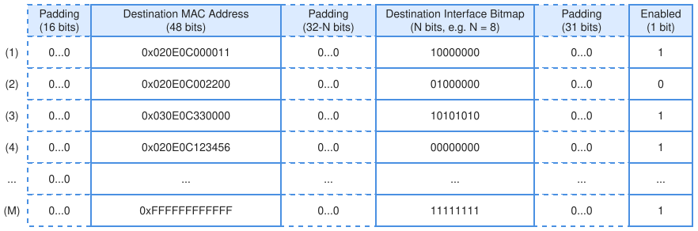

.. SPDX-FileCopyrightText: 2026 Enio Kaljic
.. SPDX-License-Identifier: CC-BY-SA-4.0

HAL Architecture Specification
==============================

Introduction
------------

The Hardware Abstraction Layer (HAL) provides a software-visible representation of openENOC hardware components and defines a standardized mechanism for accessing their Control and Status Registers (CSRs). The HAL serves as the primary interface between software and hardware, enabling configuration, monitoring, diagnostics, and runtime control of openENOC subsystems.

This document specifies the HAL architecture and CSR organization for the openENOC Switch and the openENOC Endpoint Interface. The described CSR definitions establish a common programming model for software components and serve as the authoritative reference for hardware/software integration.

CSR Specification Methodology
-----------------------------

Within this flow, Control and Status Registers are defined using `Accellera's SystemRDL 2.0 <https://www.accellera.org/downloads/standards/systemrdl>`_ as the authoritative specification format for all openENOC hardware components.

For artefact generation, the openENOC toolchain is based on `PeakRDL <https://github.com/SystemRDL/PeakRDL>`_, which processes the SystemRDL description and produces the corresponding CSR-related outputs used throughout the build and verification flow. Since the current PeakRDL implementation `does not support all features <https://peakrdl-regblock.readthedocs.io/en/latest/limitations.html>`_ of the SystemRDL 2.0 standard, CSR definitions are written with this limitation in mind to ensure that the complete register specification can be translated into all required generated artefacts without manual intervention or post-processing.

openENOC Switch HAL Architecture
--------------------------------

The openENOC Switch provides frame-forwarding and management functionality within the openENOC system. Software access to switch resources is provided through the openENOC Control Interface, which exposes a memory-mapped CSR space.

The switch HAL defines the software-visible representation of switch functionality and provides a consistent programming model independent of implementation-specific details.

Architecture
~~~~~~~~~~~~

The switch HAL is organized around a CSR-based management interface that exposes configuration, status, monitoring, and diagnostic functionality. Software components interact with switch resources through register accesses performed over the openENOC Control Interface. The HAL architecture establishes a clear separation between software-visible behavior and the underlying frame-forwarding implementation, allowing internal switch architectures to evolve while maintaining software compatibility.

A central configuration aspect of the switch HAL is the selection of the switch operating mode. In unmanaged mode, the switch operates autonomously and forwarding state is maintained by internal hardware logic. In this mode, the switch may learn forwarding table entries from observed traffic and update its forwarding state without software intervention. In managed mode, forwarding behavior is controlled through software-visible configuration mechanisms exposed by the openENOC Control Interface. This allows an external processor to populate, update, inspect, or invalidate forwarding table entries according to system-specific requirements.

The operating mode is controlled through switch configuration registers. These registers define whether the switch operates autonomously or under software control, and they provide the foundation for additional management functions such as forwarding table updates, status inspection, diagnostics, and event handling. Status registers expose the current operational state of the switch and allow software to determine whether the switch is active, idle, paused, or operating under a specific management mode.

The default forwarding behavior for frames that do not match any enabled forwarding table entry is defined through a dedicated register containing a destination interface bitmap. This register specifies the set of output interfaces to which unmatched frames shall be forwarded. In managed mode, this mechanism allows unmatched frames to be redirected toward a switch controller implemented on one of the openENOC endpoints. Such frames are delivered to the controller using the standard openENOC Endpoint Interface, preserving the same data-plane abstraction used by other endpoint-to-network communication.

Since forwarding table updates may affect the active forwarding behavior of the switch, the HAL includes a switch-level flow control mechanism used during managed reconfiguration. This mechanism is exposed through a Flow Control Register and allows software to temporarily stop or pause the flow of frames through the switch before modifying forwarding state. After the pause request is issued, software can observe the corresponding status indication to determine when the switch has reached a safe state for table modification.

Once the switch is paused, software may update forwarding table entries through the CSR space without interfering with active frame forwarding. After the update sequence is complete, software releases the pause condition and normal forwarding operation resumes. This mechanism provides a simple and deterministic way to perform controlled forwarding table reconfiguration while avoiding inconsistent lookup behavior during partial updates.

The flow control mechanism described here is local to switch management and should not be confused with link-level or protocol-level flow control. Its purpose is to coordinate software-driven CSR updates with the internal forwarding pipeline of the switch.

In managed mode, the HAL therefore provides both configuration access and operational control over the switch forwarding behavior. In unmanaged mode, the same hardware may operate without software intervention, and the openENOC Control Interface may be omitted if no external configuration or monitoring functionality is required.

Forwarding Table
~~~~~~~~~~~~~~~~

A central software-visible structure of the openENOC Switch is the forwarding table, which defines how frames are forwarded based on their destination MAC address. The table is exposed through the CSR space and can be configured by software using the openENOC Control Interface.

The forwarding table contains entries aligned to a 32-bit data bus. Each forwarding table entry is represented in the CSR space by fields containing a destination MAC address, an N-bit destination interface bitmap, a single enable bit, and padding bits required for alignment to the 32-bit bus width. The destination interface bitmap defines the set of output interfaces to which a matching frame shall be forwarded.

   Example forwarding table for an 8-port openENOC Switch

The figure illustrates an example forwarding table for an openENOC Switch with 8 ports. The table contains several representative forwarding rules. Rule (1) defines unicast forwarding of frames with destination address ``0x020E0C000011`` to the first output interface. Rule (2) represents a disabled unicast rule that remains present in the table but is not applied during forwarding lookup. Rule (3) defines multicast forwarding of frames with destination address ``0x030E0C330000`` to the first, third, fifth, and seventh output interfaces. Rule (4) defines frame dropping for destination address ``0x020E0C123456`` by means of an enabled entry with an empty destination interface bitmap. Rule (M) defines the broadcast forwarding rule for frames with destination address ``0xFFFFFFFFFFFF``.

Register Definitions and CSR Memory Map
~~~~~~~~~~~~~~~~~~~~~~~~~~~~~~~~~~~~~~~

The SystemRDL source shown below defines the CSR structure of the openENOC Switch. This source file is the maintained register specification used by the PeakRDL-based generation flow.

.. literalinclude:: ../../hal/src/openenoc_switch.rdl
   :language: systemverilog
   :caption: SystemRDL specification of the openENOC Switch CSR map
   :linenos:

The openENOC Switch CSR memory map and detailed register documentation are derived directly from this SystemRDL specification. The generated CSR documentation provides the corresponding human-readable description of the register hierarchy, address offsets, field layouts, access permissions, reset values, and associated register semantics.

The complete generated CSR documentation is available in :doc:`/generated/openenoc_switch`.

openENOC Endpoint Interface HAL Architecture
--------------------------------------------

The openENOC Endpoint Interface provides the connection between processing elements and the openENOC network. It exposes endpoint control, status monitoring, and communication management functionality through a dedicated CSR space.

The endpoint HAL establishes a uniform software interface for accessing endpoint resources and controlling interactions with the network.

Architecture
~~~~~~~~~~~~

The endpoint HAL is organized around a CSR-based management interface that exposes endpoint configuration, software-visible stream access, remote peer configuration, DMA control, and a virtual remote-memory region. Software components interact with endpoint resources through register accesses performed over the openENOC Control Interface. The HAL architecture establishes a clear separation between software-visible endpoint behavior and the underlying oETP frame handling, allowing internal buffering, DMA scheduling, and protocol processing logic to evolve while maintaining software compatibility.

A central configuration aspect of the endpoint HAL is the description of the local endpoint instance and the set of remote peers that it can access. The read-only information register exposes implementation parameters such as the total depth of the virtual remote-memory region and the number of supported remote peers. These values allow software to discover the size and structure of the endpoint address space without relying on hard-coded assumptions.

The endpoint configuration registers define the local MAC address used by the endpoint when exchanging frames with the openENOC network. Remote communication targets are described through a peer table, where each entry contains the MAC address of a remote peer, the offset of the corresponding virtual remote-memory region, the local memory base address, the remote memory base address, and the size of the region. This structure allows software to describe how local memory resources are related to remote memory regions visible through the endpoint.

The HAL supports two complementary access models. The first model is a software-visible AXI4-Stream access path exposed through source and sink register files. The source register file allows software to provide stream data words, assert the corresponding valid indication, and mark the last word of a frame. Software observes the ready status to determine when the endpoint can accept the next transfer. Conversely, the sink register file allows hardware to present received stream data to software, together with valid and last indications, while software acknowledges reception through the ready control field.

This CSR-mapped AXI4-Stream interface mirrors the basic AXI4-Stream handshake semantics in software-visible form. It is useful for low-bandwidth communication, diagnostics, initialization sequences, and simple software-driven frame exchange. The mechanism does not prescribe the internal implementation of the endpoint datapath; it only defines how stream-oriented transfers are exposed through the HAL.

The second access model is memory-oriented communication through the virtual remote-memory region. This region provides a software-visible address space representing memory associated with one or more remote peers. The mapping between a remote peer and its corresponding portion of the virtual memory space is defined by the peer configuration registers. Accesses to this region may be handled directly or used as the basis for DMA-driven transfers, depending on the configured DMA mode for the selected peer.

DMA behavior is controlled independently for each peer. When DMA operation is disabled, the peer entry remains configured but no automatic transfer is performed. In transparent mode, accesses to the virtual remote-memory region are translated into corresponding accesses to the remote peer memory region on a word-by-word basis. This mode is suitable when software requires a direct memory-mapped view of remote resources and when simple access semantics are preferred over bulk synchronization.

The endpoint HAL also supports mirrored transfer modes. In mirror-to-local mode, the local memory region is used as the software-visible representation of the remote peer memory, and the state of the remote memory region is fetched from the remote peer on demand or periodically. In mirror-to-remote mode, the remote memory region is used as the destination representation, and the state of the local memory region is sent to the remote peer on demand or periodically. These modes allow software to configure endpoint-to-endpoint memory synchronization without directly managing individual transport frames.

DMA transfers are initiated through a peer-specific request field. The corresponding status fields indicate whether the DMA engine is idle, whether the requested transfer has completed successfully, or whether an error has occurred. A typical software sequence therefore consists of configuring the peer address mapping, selecting the DMA mode, issuing a transfer request, and observing the idle, done, and error status indications until the operation reaches a terminal state.

The DMA control mechanism described here is local to endpoint management and should not be confused with Ethernet link-level or protocol-level flow control. Its purpose is to coordinate software-visible memory mappings and transfer requests with the internal endpoint datapath, DMA engine, and oETP processing logic.

The endpoint HAL therefore provides both a stream-oriented and a memory-oriented abstraction for communication with the openENOC network. The AXI4-Stream register interface offers a simple CSR-accessible path for direct frame exchange, while the peer table, virtual remote-memory region, and DMA controls provide a scalable mechanism for accessing and synchronizing memory resources across endpoints.

Register Definitions and CSR Memory Map
~~~~~~~~~~~~~~~~~~~~~~~~~~~~~~~~~~~~~~~

The SystemRDL source shown below defines the CSR structure of the openENOC Endpoint Interface. This source file is the maintained register specification used by the PeakRDL-based generation flow.

.. literalinclude:: ../../hal/src/openenoc_endpoint.rdl
   :language: systemverilog
   :caption: SystemRDL specification of the openENOC Endpoint Interface CSR map
   :linenos:

The openENOC Endpoint Interface CSR memory map and detailed register documentation are derived directly from this SystemRDL specification. The generated CSR documentation provides the corresponding human-readable description of the register hierarchy, address offsets, field layouts, access permissions, reset values, and associated register semantics.

The complete generated CSR documentation is available in :doc:`/generated/openenoc_endpoint`.

Summary
-------

This document defines the HAL architecture and CSR organization for the openENOC Switch and the openENOC Endpoint Interface.

The HAL establishes a consistent software-visible programming model based on memory-mapped Control and Status Registers, while the CSR specification provides the authoritative description of hardware/software interactions. Together, these mechanisms form the foundation for software development, system integration, and verification activities within the openENOC project.

.. toctree::
   :hidden:

   generated/openenoc
   generated/openenoc_switch
   generated/openenoc_endpoint
