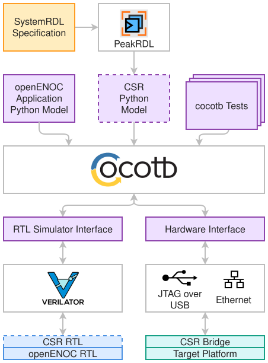
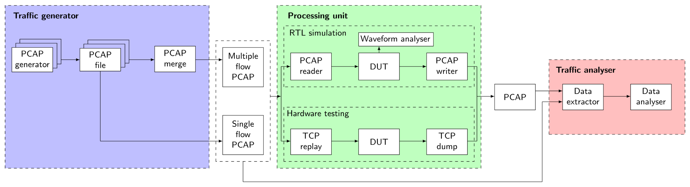

.. SPDX-FileCopyrightText: 2026 Enio Kaljic
.. SPDX-FileCopyrightText: 2026 Amina Tankovic
.. SPDX-License-Identifier: CC-BY-SA-4.0

Verification Infrastructure
===========================

Introduction
------------

The openENOC verification infrastructure provides a unified framework for functional verification of hardware, software, and hardware/software interactions throughout the project lifecycle. The framework is based on open-source tools, primarily Verilator and cocotb, and is designed to support fast, scriptable, and reproducible verification workflows.

Verification activities are developed in parallel with RTL and software development. The infrastructure emphasizes reuse, allowing common verification components, register models, and test scenarios to be applied consistently across simulation and hardware environments. Particular attention is given to supporting parameterized designs, heterogeneous configurations, and multiple clock domains, which are expected to be common characteristics of future openENOC-based systems.

The infrastructure also incorporates concepts previously developed for reproducible verification and benchmarking of networking hardware, particularly the use of PCAP-based traffic replay and capture mechanisms for protocol-aware testing and analysis. These concepts provide a practical foundation for validating Ethernet-based communication subsystems and higher-level networking functionality.

Verification Architecture
-------------------------

The verification architecture is organized into several complementary levels, each targeting a different stage of system integration:

* **Component-Level Verification** — Individual RTL modules are verified using dedicated cocotb testbenches. This level focuses on functional correctness, protocol compliance, corner-case handling, and parameterized configurations. Future work will expand this layer with protocol-aware verification environments and coverage-driven testing of datapath components introduced throughout the project.
* **HAL-Level Verification** — Hardware functionality is verified through software-visible interfaces rather than direct signal manipulation whenever practical. This approach aligns verification with the Hardware Abstraction Layer (HAL) used by software components and enables reuse of test scenarios across simulation and hardware platforms. This level also establishes the foundation for later hardware/software co-verification by ensuring that software-visible behavior remains consistent across simulation and hardware environments.
* **Subsystem-Level Verification** — Multiple RTL components are verified together as integrated subsystems. Typical examples include communication endpoints, switching elements, control subsystems, and other functional blocks composed of several reusable components. Subsequent project phases will extend subsystem verification to packet-processing pipelines, switching elements, DMA subsystems, and interactions between heterogeneous interfaces and clock domains.
* **System-Level Verification** — Complete reference systems and demonstration platforms are verified using realistic traffic patterns and application-level scenarios. This level validates interactions between hardware, software, and external interfaces. This level ultimately evolves toward software-driven end-to-end verification, where complete applications interact with the simulated and physical openENOC platform.

Verification Framework
----------------------

The verification framework is built around Verilator and cocotb. Verilator serves both as a high-performance RTL simulator and as the primary linting tool within the development workflow, enabling verification activities to begin with static design checks before progressing to functional simulation. Cocotb enables development of verification components and test scenarios in Python, providing a flexible and reusable environment for functional verification.

The framework includes reusable drivers, monitors, scoreboards, and utility libraries that can be shared across verification levels. Tests are designed to be parameterizable, allowing the same verification scenarios to be executed across multiple configurations, including different data widths, interface options, and clocking arrangements.

While the initial focus is on establishing reusable infrastructure, the framework is designed to support future protocol-aware scoreboards, functional coverage collection, layered testbench architectures, automated regression execution, and continuous integration workflows.

CSR-Based Verification
~~~~~~~~~~~~~~~~~~~~~~

Control and Status Register (CSR) definitions are described using SystemRDL and serve as the single source of truth for register-level interfaces.

   CSR-Based Verification Framework

PeakRDL-generated Python models are used within the verification environment to provide a consistent abstraction of the register map. This approach enables automated verification of control-plane functionality while ensuring alignment between RTL implementations, software APIs, documentation, and verification artefacts.

By deriving verification models directly from the SystemRDL specification, register-level tests can be developed independently of implementation details, reducing duplication and improving maintainability as the design evolves.

The generated CSR models also provide a common software interface that can be connected either to a simulated RTL environment or to physical hardware through the Hardware Interface abstraction layer. This enables the same verification software, configuration utilities, and diagnostic tools to be reused across simulation and hardware environments, minimizing differences between development and deployment workflows.

As a result, software-driven verification can be performed early in the development process using simulated hardware models and later reused for validation on FPGA-based platforms without significant modifications.

Traffic-Based Verification
~~~~~~~~~~~~~~~~~~~~~~~~~~

Since openENOC is built around Ethernet-based communication, the verification framework adopts a PCAP-based traffic methodology inspired by previous work on verification and benchmarking of networking and cryptographic hardware. In this approach, packet traces are used as reproducible test vectors that can be injected into both simulated and physical implementations.

   Traffic-Based Verification Framework

Traffic stimuli are generated from recorded or synthesized Ethernet traces and injected into simulations through dedicated source models. Corresponding sink models capture resulting Ethernet frames and store them as PCAP files for post-processing and analysis. This approach is conceptually aligned with the PCAP reader and PCAP writer methodology, where network traffic is replayed through a device under test and captured again for functional and performance evaluation. 

The use of PCAP files enables reproducible regression testing, reuse of real network traffic captures, protocol-level debugging, and integration with standard analysis tools such as Wireshark. Captured traces can be compared against reference outputs, enabling packet-level scoreboarding and protocol-aware verification. Furthermore, the same methodology can be applied in both RTL simulation and hardware-based testing environments, providing a consistent verification workflow throughout the project lifecycle. 

Multi-Clock Domain Verification
~~~~~~~~~~~~~~~~~~~~~~~~~~~~~~~

The framework is designed to support systems containing multiple clock domains. Verification components can operate with independent clocks and configurable timing relationships, allowing realistic validation of clock-domain crossings and synchronization mechanisms.

Parameterized test scenarios are used to exercise different clocking configurations and verify correct operation under a wide range of timing conditions.

ISS-Based Co-Verification
~~~~~~~~~~~~~~~~~~~~~~~~~

The current verification infrastructure focuses on Python-based software-driven verification using generated CSR models and reusable hardware interface abstractions. While this approach enables early validation of control-plane functionality, it does not yet exercise complete embedded software stacks executing on a processor model.

Future phases will introduce integration with instruction set simulators (ISS) for supported processor architectures, enabling execution of unmodified software against simulated hardware. This will allow HAL implementations, runtime libraries, and application software to interact with the simulated openENOC platform using the same execution model expected in deployed systems.

The ISS environment will be integrated with the existing verification infrastructure and CSR abstraction layers, allowing verification scenarios developed during earlier project phases to be reused as the software stack evolves. This approach will enable end-to-end validation of register access, DMA configuration, packet forwarding behavior, interrupt handling, and other software-driven interactions between control-plane and datapath components.

Verification Roadmap
--------------------

The verification infrastructure is intended to evolve incrementally alongside the RTL and software stacks.

The initial phase focuses on establishing a reusable verification framework based on Verilator, cocotb, SystemRDL, PeakRDL-generated software models, and reusable hardware interface abstractions. This foundation provides a consistent environment for validating both datapath and control-plane functionality across simulation and hardware-backed environments while supporting parameterized configurations and heterogeneous system architectures.

Subsequent phases will introduce layered verification environments for datapath components, packet-processing pipelines, switching primitives, metadata handling mechanisms, and DMA subsystems. These environments will incorporate protocol-aware stimulus generation, reusable scoreboards, and functional coverage collection to improve confidence across a wide range of operating conditions.

Later development stages will integrate instruction set simulators (ISS) for supported processor architectures, enabling execution of unmodified software against simulated hardware. This will allow end-to-end verification of control-plane functionality, DMA configuration, forwarding behavior, and other software-driven scenarios using the same APIs and abstractions employed by deployed applications.

The verification infrastructure will then be extended with automated regression testing and continuous integration workflows. Verification suites developed throughout the project will be executed across multiple configurations to ensure reproducibility, detect regressions, and maintain quality as the platform scales.

Beyond simulation, the framework will be progressively extended with FPGA-based verification environments, allowing the same software, traffic traces, and verification workflows to be reused on physical hardware. This will help identify implementation-specific issues related to timing, resource utilization, clock-domain interactions, and overall system integration.

Ultimately, the verification infrastructure is intended to evolve into a long-term quality assurance framework for the openENOC ecosystem, providing reproducible reference environments for both project developers and external adopters.

Summary
-------

This document presented the initial verification infrastructure for the openENOC platform. The proposed approach establishes a unified verification framework based on Verilator, cocotb, SystemRDL, PeakRDL-generated software models, and reusable hardware interface abstractions, enabling consistent validation of both datapath and control-plane functionality across simulation and hardware environments.

The infrastructure introduces a layered verification strategy spanning component-level, HAL-level, subsystem-level, and system-level verification. It also defines a reusable methodology for register-level verification, software-driven testing, multi-clock validation, and Ethernet traffic verification using PCAP-based workflows inspired by previous networking hardware verification research.

Together, these foundations provide a scalable and extensible verification infrastructure that will support the continued development of the openENOC hardware and software stack while maintaining reproducibility, portability, and long-term maintainability.

